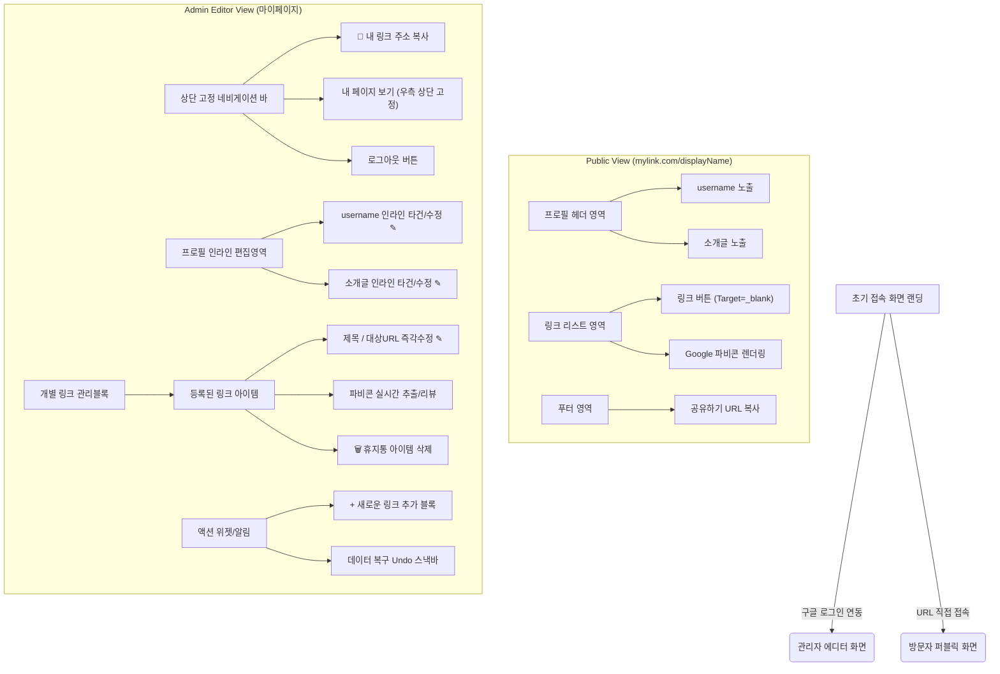

# 마이링크 (MyLink) - 화면 구조 및 와이어프레임

본 문서는 마크다운, 머메이드(Mermaid) 다이어그램, 및 ASCII 아트를 활용하여 **방문자 페이지(Visitor View)**와 **소유자 관리자 편집화면(Owner Admin View)**의 화면 레이아웃 방향성과 UI 컴포넌트 구조를 설계합니다.

---

## 1. 개체 구성 및 네비게이션 플로우 (Mermaid)

서비스의 전체적인 뷰(View) 간 라우팅 설계와 컴포넌트 트리입니다.



---

## 2. 화면 구성 와이어프레임 (ASCII Art)

모바일 중심의 방문자 화면 UI와, PC/모바일에 제약 없이 반응형을 지원해야 하는 마이페이지(에디터)의 시각적 요소를 표현합니다.

### 2.1 방문자용 퍼블릭 페이지 (Mobile View Base)
사진이 배제된 심플한 텍스트 중심 프로필과 파비콘이 조합된 매끄러운 링크 리스트 위젯 형태로 렌더링됩니다.

```text
  [ 모바일 스크린 기준 ]
+---------------------------------------+
|                                       |
|             [ username ]              |
|        여기에 간략한 소개글이 들어갑니다.   |
|                                       |
|   +-------------------------------+   |
|   | (F) 내 블로그 바로가기          |   |
|   +-------------------------------+   |
|                                       |
|   +-------------------------------+   |
|   | (F) 포트폴리오 사이트 (새 탭)    |   |
|   +-------------------------------+   |
|                                       |
|                                       |
|               [공유하기]                |
|                                       |
+---------------------------------------+
※ (F) 기호 = 구글 API에서 자동 추출되어 렌더링된 파비콘 이미지
```

### 2.2 소유자 관리자 기능 (마이페이지 에디터 공통)
어떤 항목을 클릭해야 수정할 수 있는지 사용자가 즉시 알 수 있도록 수정 가능 영역들 우측에는 연필(✎) 모양이 항시 고정 표시됩니다.

```text
+---------------------------------------------------------------+
| [MyLink 로고]                           [내 페이지 보기] [로그아웃] |
| 🔗 내 링크 주소: mylink.com/displayName                           |
+---------------------------------------------------------------+
|                                                               |
|  [ 프로필 구역 ] (마이페이지 에디터 모드 편집 가능 액션 인지 ✎)          |
|   ▶ username (여기를 터치하여 닉네임을 수정하세요) ✎                 |
|   ▶ 노출할 프로필 소개 문구를 자유롭게 입력해주세요 ✎                 |
|                                                               |
|---------------------------------------------------------------|
|  [ 등록 링크 관리 리스트 ]                                       |
|                                                               |
|  +---------------------------------------------------------+  |
|  | (F) | 제목: 내 블로그 바로가기 ✎                    |[🗑️] |  |
|  |     | URL: https://blog.com... ✎                    |    |  |
|  +---------------------------------------------------------+  |
|                                                               |
|  +---------------------------------------------------------+  |
|  | (F) | 제목: 디자이너 포트폴리오 사이트 ✎                |[🗑️] |  |
|  |     | URL: https://port... ✎                        |    |  |
|  +---------------------------------------------------------+  |
|                                                               |
|       [ + 링크 새로 만들기 영역 ]                              |
|                                                               |
+---------------------------------------------------------------+
※ 링크 아이템 삭제 시 하단 임시 알람 UI: [ 1개의 링크가 삭제되었습니다. (실행 취소) ]
```

---

## 3. UI/UX 구현 개발을 위한 핵심 기능 체크리스트
1. **편집 가능성 상시 인지 강화 (Always-on Pencil Icon)**: 관리자 대시보드(마이페이지) 내에서 닉네임(`username`)이나 소개문구, 링크 내용 등 사용자가 '직접 편집 가능한 모든 텍스트 필드' 우측에는 무조건 편집 아이콘(`✎`)이 항시 노출되어 직관성을 높여야 합니다. (실제 뷰어 화면에는 노출 금지)
2. **우측 상단 뷰어 바로가기 버튼 (상단 고정)**: 내 프로필과 링크를 다 꾸민 사용자가 결과물을 실제로 확인하러 나갈 수 있는 수단인 **[내 페이지 보기]** 버튼을 헤더(Navbar)의 우측 상단 영역에 고정(Sticky/Fixed layout) 배치하여 화면을 스크롤해도 쉽게 찾아갈 수 있게 합니다.
3. **인라인 수정 전환 트랜지션 (Inline Edit)**: 사용자가 연필 아이콘이나 텍스트 덩어리를 클릭 시, 화면 안에서 `<input>`이나 `<textarea>` 폼 위젯으로 딜레이 없이 자연스럽게 변경되어 즉시 내용을 수정할 수 있도록 합니다.
